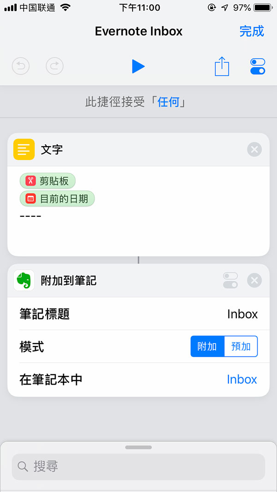

# 关于知识的整理与记忆

## 流程
1. [收集](#collect)
2. 释义
3. 整理成卡片
4. 复习

## <a name="collect"/>收集
### 场景1：iOS
#### 相关App
- Evernote
- Shortcut (捷径)

#### 操作说明
以生词为例，遇到不认识的单词，先用 iOS 自带的词典查阅一次意思，然后 copy，使用自定义Shortcut 添加到 Evernote 的 New words 笔记本。演示如下：

 
##### Tips
> - 操作里面查单词的步骤不是必要的，但为了能更顺利的阅读下去，先让自己了解一下单词的意思。
> - 不一定需要等「捷径」完成，就可以上滑关闭「小工具」

#### 关于 Shortcut
Shortcut 是 iOS 官方出品的创建 workflow 的 App，可以用来创建很多有用的快捷操作，比如上述的一键收集剪贴板到 Evernote，又比如一键发送当日天气预报给老婆 (🤨)。上边的捷径配置如下：

 

#### 关于 Evernote
Evernote 是最熟知的笔记应用，开发得比较成熟，很多应用都有针对 Evernote 的分享接口。当然你也可以在捷径中设置成其他笔记应用，比如 Bear。但我自己试过，收集到 Evernote 是最快的，收集到 Bear 会产生跳转动作，打断阅读。
