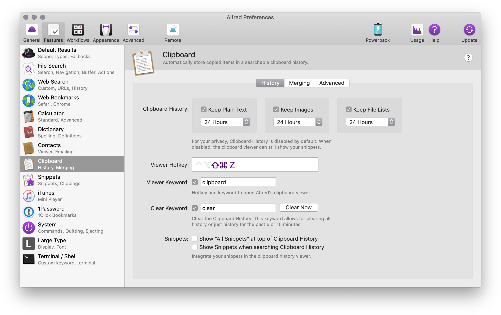
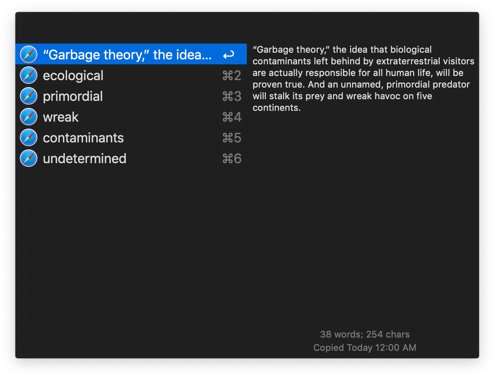

# 关于知识的整理与记忆

# 目录
- TLDR;
- 收集
	- iOS
		- [方案 1: 捷径 + Evernote](#collect-1)
		- [方案 2: Pin (或 Copied / Paste 2) + Evernote](#collect-2)
	- macOS
	- Kindle (TBC)
	- 实体书 (TBC)
- 释义
- 整理成卡片
- 复习
# 附录
- iOS / macOS 相关技巧
	- 剪贴板同步
	- 如何使用小工具
	- 第三方键盘
	- 系统字典配置
- 相关 App 介绍
	- [Evernote](#appendix-evernote)
	- [捷径](#appendix-evernote)
	- Pin
	- Alfred
	- Copied
	- Quizlet
	- Anki

---

## 收集
### 场景 1：iOS

#### 方案 1: 捷径 + Evernote
以生词为例，遇到不认识的单词，先用 iOS 自带的词典查阅一次意思，然后 copy，使用自定义Shortcut 将刚刚复制的内容添加到 Evernote 的 New words 笔记本。演示如下：

一键收集剪贴板到 Evernote 的捷径配置如下图：

 

#### Tips
- 操作里面查单词的步骤不是必要的，但为了能更顺利的阅读下去，先让自己了解一下单词的意思。
- 当然你也可以在捷径中设置成其他笔记应用，比如 Bear。但我自己试过，收集到 Evernote 是最快的，收集到 Bear 会产生跳转动作，打断阅读。
- 不需要等「捷径」完成，就可以上滑关闭「小工具」。
- 除了演示中的收集单词，也可以利用「捷径」和 Evernote 收集网络文章、新闻段落，甚至增加一步「立即打开该笔记」记录下当前的想法。

 

#### 方案 2: Pin (或 Copied / Paste 2) + Evernote
还是以 iOS 的剪贴板为基础，将剪贴板内的内容先利用 Pin (或其他剪贴板管理 App 比如 Copied 或 Paste 2) 的小工具逐个将单词收集起来，然后利用 Pin 的第三方键盘，将内容收集到 Evernote。演示：

#### Tips
- 因为 iOS 禁止 App 在非激活状态下获取剪贴板内容，所以每 copy 一个/一段文字，需要打开小工具面板，让 Pin 等应用处于激活状态，获取最近的剪贴板内容。

 

#### 两个方案对比
- **方案 1** 完全免费，**方案 2** 中的 Pin 需要 6 元购买。
- **方案 1** 比**方案 2** 多了一次点击「捷径」的动作。
- **方案 1** 中的「捷径」因为指定了某个笔记，所以能够明确预期，每次复制后，点击「捷径」，目标笔记内的所收集内容，都是相同性质的；而**方案 2** 由于剪贴板历史可能并不所有都是需要收集到同一本笔记的内容，所以到后期批量录入的时候需要费点神区别一下。

 

### 场景2: macOS
#### 方案1: Evernote 快捷笔记
在 Mac 打开 Evernote 你会见到屏幕顶部菜单栏右方的大象图标，点击它或者使用快捷键 `⌘ + ctrl + N` 会弹出一个快速笔记的窗口，这就是用来快速录入你在电脑前想收集的任何信息，包括但不限于：生词、文字段落、网址、图片等信息。在这里面输入的一切只是临时的，直到按下窗口下方的「保存到 Evernote」，才会将窗口内的所有内容新建成一份独立的笔记，此后快速笔记窗口的内容将被清空。

 

#### 方案2: Alfred PowerPack (或 Pin) + Evernote
Alfred 可以说是 Mac 用户必备装机 App，免费功能包括：快速启动程序、自定义搜索、快速查字典、快速计算，付费后开通的 PowerPack 功能包括自定义 Workflow，以及现在要介绍的快速获取剪贴板功能。
与 Pin 等剪贴板扩展 App 类似，Alfred 也有剪贴板历史，与 iOS 不同的是，macOS 允许应用在背景获取剪贴板内容，因此你可以狂按 `⌘ + C` 不断保存剪贴板历史。
先在 Alfred 设置好「弹出剪贴板历史」的全局快捷键：

按下后效果如图：

现在打开 Evernote 的相应笔记，弹出 Alfred 的剪贴板历史，按下 `⌘ + n(旁边的数字)` 粘贴需要的内容。
 

---

# 附录

## iOS / macOS 相关技巧
### 剪贴板同步
### 如何使用小工具
### 第三方键盘
### 系统字典配置
## 相关 App 介绍
### Evernote
[知乎上的 Evernote](https://www.zhihu.com/search?q=evernote&type=content)
### 捷径
[知乎上的「捷径」](https://www.zhihu.com/search?q=捷径%20ios&type=content)
### Pin
### Alfred
### Copied
### Quizlet
### Anki